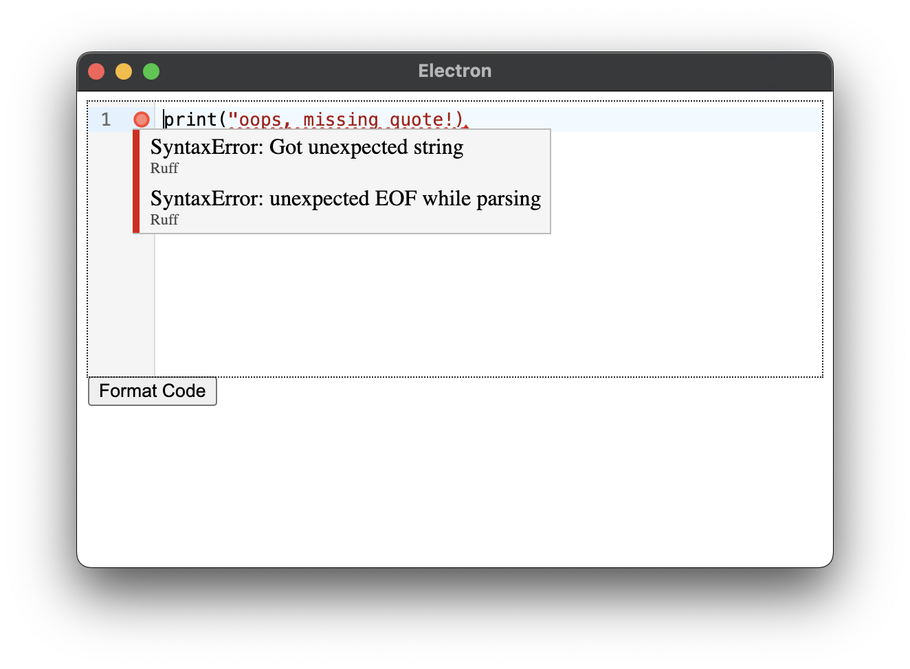

# lsp-editor

A simple python code editor with code formatting and linting.

This is a toy experiment to show how to integrate the [ruff](https://github.com/astral-sh/ruff) language server into a code editor.

This editor is built with [Electron](https://www.electronjs.org/), [CodeMirror](https://codemirror.net/), and VS Code's [language server client library](https://github.com/Microsoft/vscode-languageserver-node).

This is a toy experiment for demonstration purposes only. The code editor does not persist data or open files.



## Recommended IDE Setup

- [VSCode](https://code.visualstudio.com/) + [ESLint](https://marketplace.visualstudio.com/items?itemName=dbaeumer.vscode-eslint) + [Prettier](https://marketplace.visualstudio.com/items?itemName=esbenp.prettier-vscode)

## Project Setup

### Install

```bash
$ npm install
```

You will also need to have `ruff` installed and available in your path.

### Running tests

Make sure your ruff client is installed and availiable by running the tests

```bash
$ npm test
```

### Development

```bash
$ npm run dev
```
